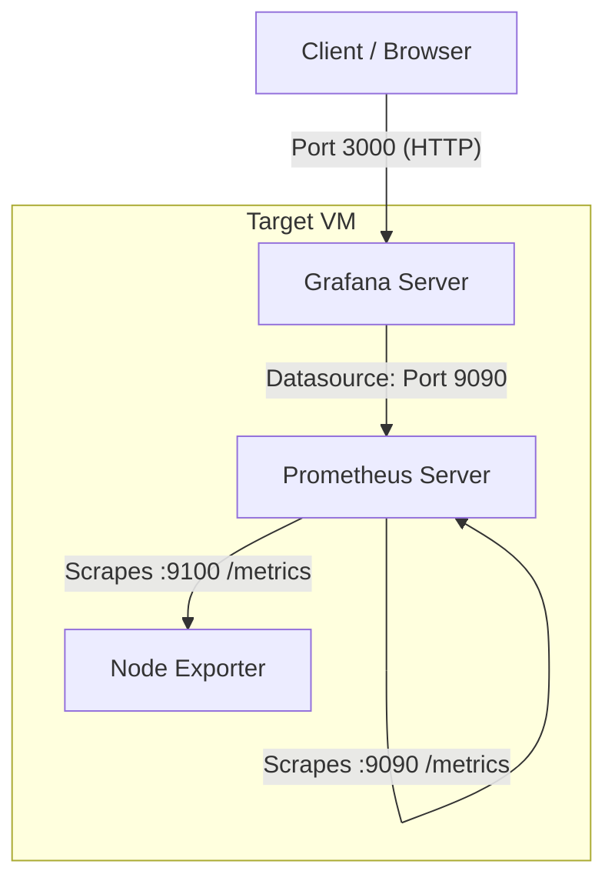

# Scenario 2 — Monitoring Stack (Prometheus, Node Exporter, Grafana)

## Architecture

The diagram below illustrates the monitoring architecture deployed on the target VM:




---

## Code

### Playbook & Roles

The playbook execution entry point is `main.yml`, executing modular, dedicated roles:
- `node_exporter`: Installs and configures Node Exporter service on port 9100.
- `prometheus`: Installs and configures Prometheus server on port 9090.
- `grafana`: Installs Grafana OSS on port 3000, provisions Prometheus datasource and CPU/Memory dashboard.

### Detailed Role Breakdown

- **Role: `node_exporter`** (`roles/node_exporter/`):
  - Creates dedicated system user/group `node_exporter` (`/sbin/nologin`).
  - Downloads and installs `node_exporter` binary (`v1.7.0`) into `/usr/local/bin`.
  - Configures systemd service `node_exporter.service` listening on `0.0.0.0:{{ node_exporter_port }}`.
  - Ensures service is enabled and started on boot.

- **Role: `prometheus`** (`roles/prometheus/`):
  - Creates dedicated system user/group `prometheus` (`/sbin/nologin`).
  - Sets up directories `/etc/prometheus` and `/var/lib/prometheus`.
  - Downloads and unpacks official Prometheus binary (`v2.51.0`).
  - Templates `prometheus.yml.j2` configuring scraping for itself (`:9090`) and Node Exporter (`:9100`).
  - Configures systemd unit `prometheus.service` listening on `0.0.0.0:{{ prometheus_port }}`.
  - Ensures service is enabled and running.

- **Role: `grafana`** (`roles/grafana/`):
  - Adds Grafana official apt repository key and repository.
  - Installs `grafana` package via apt.
  - Configures HTTP port (`3000`) and admin credentials in `/etc/grafana/grafana.ini`.
  - Automatically provisions the Prometheus datasource via `provisioning/datasources/prometheus.yaml`.
  - Automatically provisions dashboard provider `provisioning/dashboards/dashboards.yaml` and deploys `cpu_memory_dashboard.json`.
  - Ensures `grafana-server` service is enabled and started on boot.

- **Role: `monitoring`** (`roles/monitoring/`):
  - Acts as a meta-role wrapper that includes `prometheus`, `node_exporter`, and `grafana` roles.

---

### Inventory

The inventory is organized under the `inventory/` directory:
- `inventory/inventory/all.yml`: Defines the `all` group and child groups (`monitoring`).
- `inventory/inventory/monitoring.yml`: Defines host `mon-1` with `ansible_host` and `ansible_user`.
  - Configured for Vagrant (`192.168.56.10` / `vagrant`) or easily replaced by the given VM IP and user.
- `inventory/group_vars/monitoring.yml`: Defines service ports (`prometheus_port: 9090`, `grafana_port: 3000`, `node_exporter_port: 9100`).

---

## Credentials / Login

```yaml
# Grafana Web Interface (http://<HOST_IP>:3000)
user: admin
pass: admin_password123

# Prometheus Web Interface
URL: http://<HOST_IP>:9090

# Node Exporter Metrics Endpoint
URL: http://<HOST_IP>:9100/metrics
```

---

## Challenges & Solutions

+ **Automated Dashboard & Datasource Provisioning**:
  - *Challenge*: Setting up Grafana manually through the UI is not reproducible in automated CI/CD or Ansible runs.
  - *Solution*: Utilized Grafana's native file-based provisioning system (`/etc/grafana/provisioning/datasources` and `/etc/grafana/provisioning/dashboards`) with an automated CPU & Memory dashboard JSON.
+ **Service Isolation & Security**:
  - *Challenge*: Running monitoring services directly as root poses security risks.
  - *Solution*: Created isolated system accounts (`prometheus`, `node_exporter`) with `/sbin/nologin` and minimal directory permissions.
+ **Idempotency in Binary Downloads**:
  - *Challenge*: Re-downloading Prometheus and Node Exporter tarballs on every playbook execution causes unnecessary network overhead.
  - *Solution*: Added `stat` check tasks in Ansible to verify binary existence before downloading and extracting archives.
+ **Error Handling**:
  - *Challenge*: Playbook execution failures can leave services in inconsistent states or expose sensitive credentials in CI/CD logs.
  - *Solution*: Implemented `block / rescue / always` constructs across all roles for automated rollback (restoring `.bak` configurations), sanitizing sensitive tasks with `no_log: true`, post-deployment API health checks (`uri` module with retries), and SSH `pipelining` for performance and connection stability.
